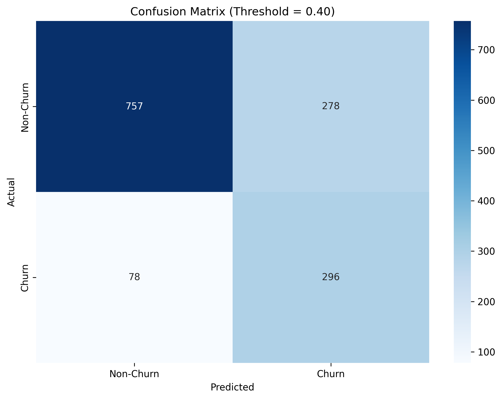
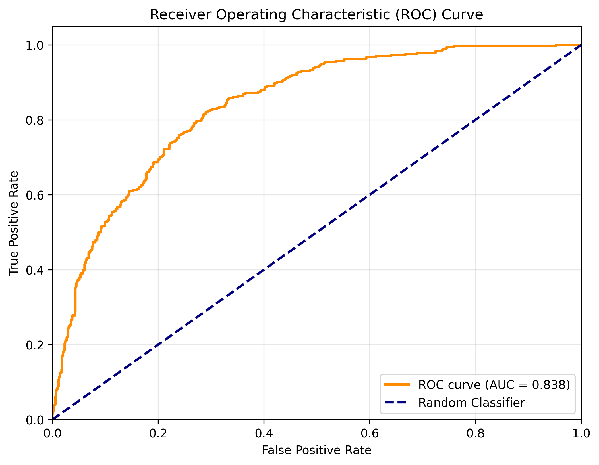
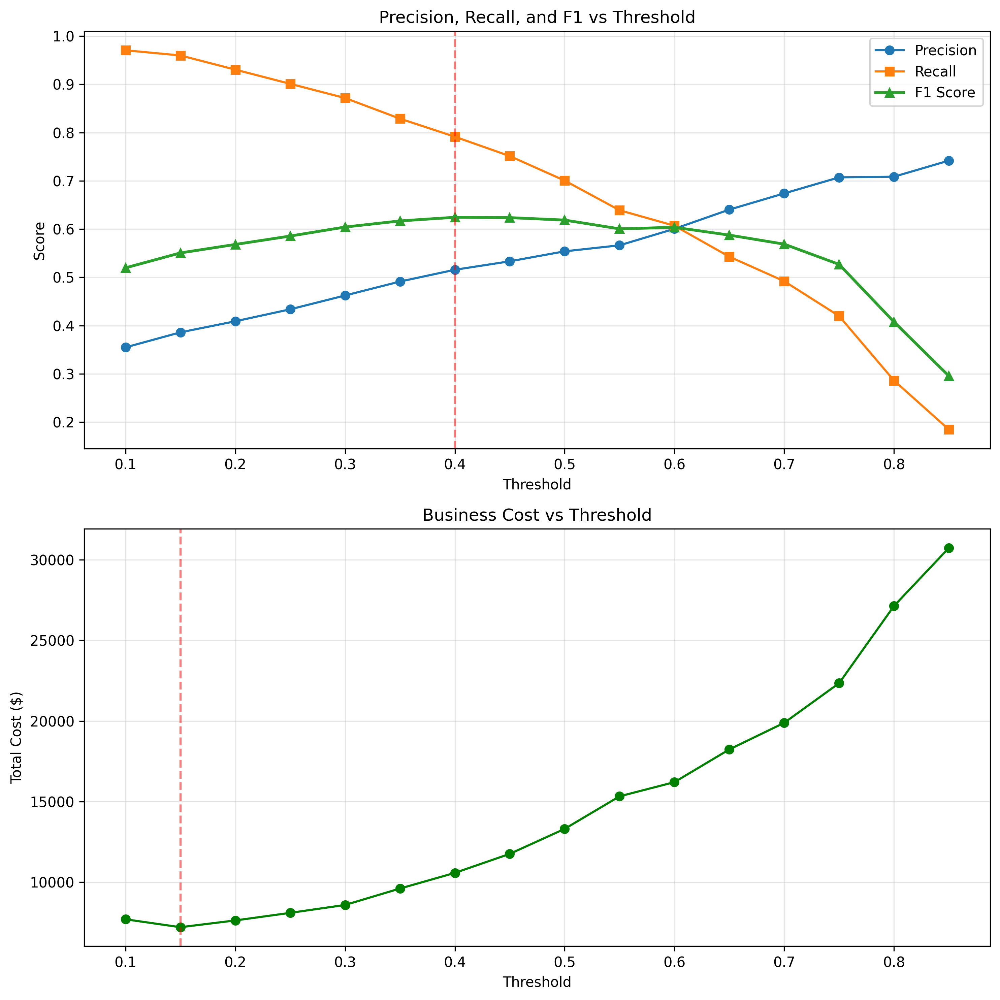
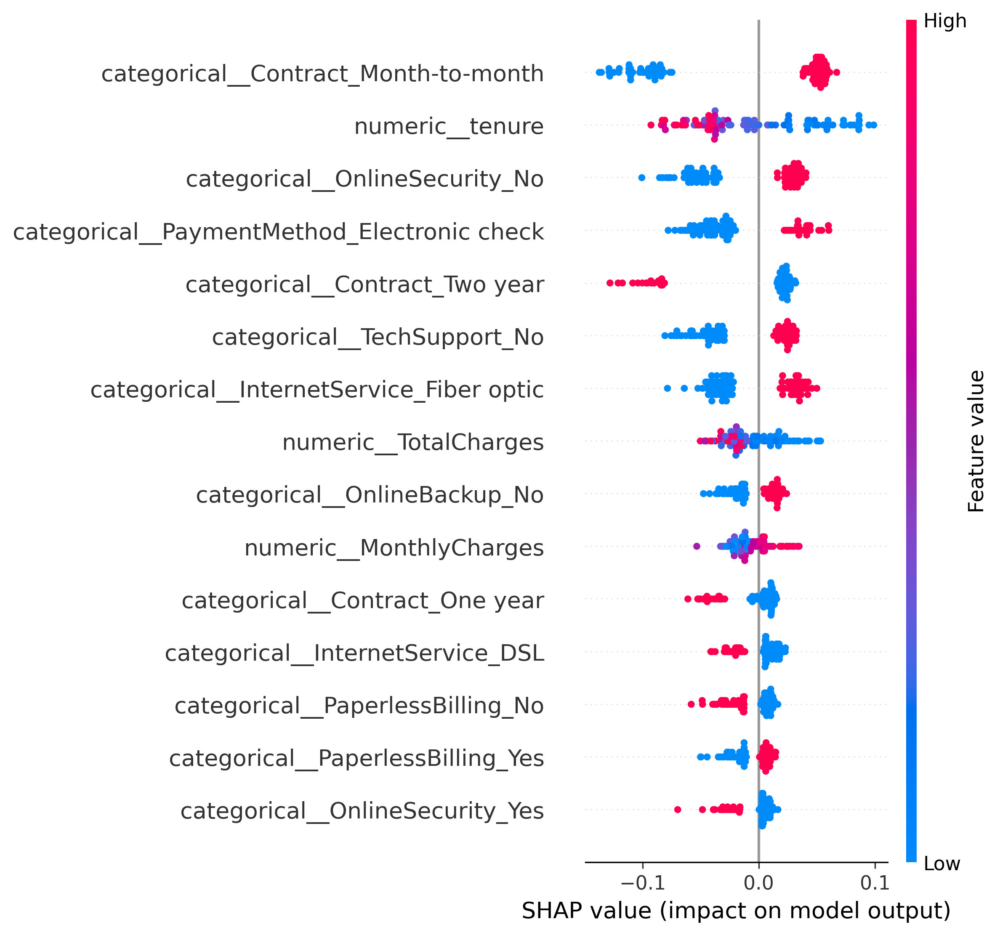
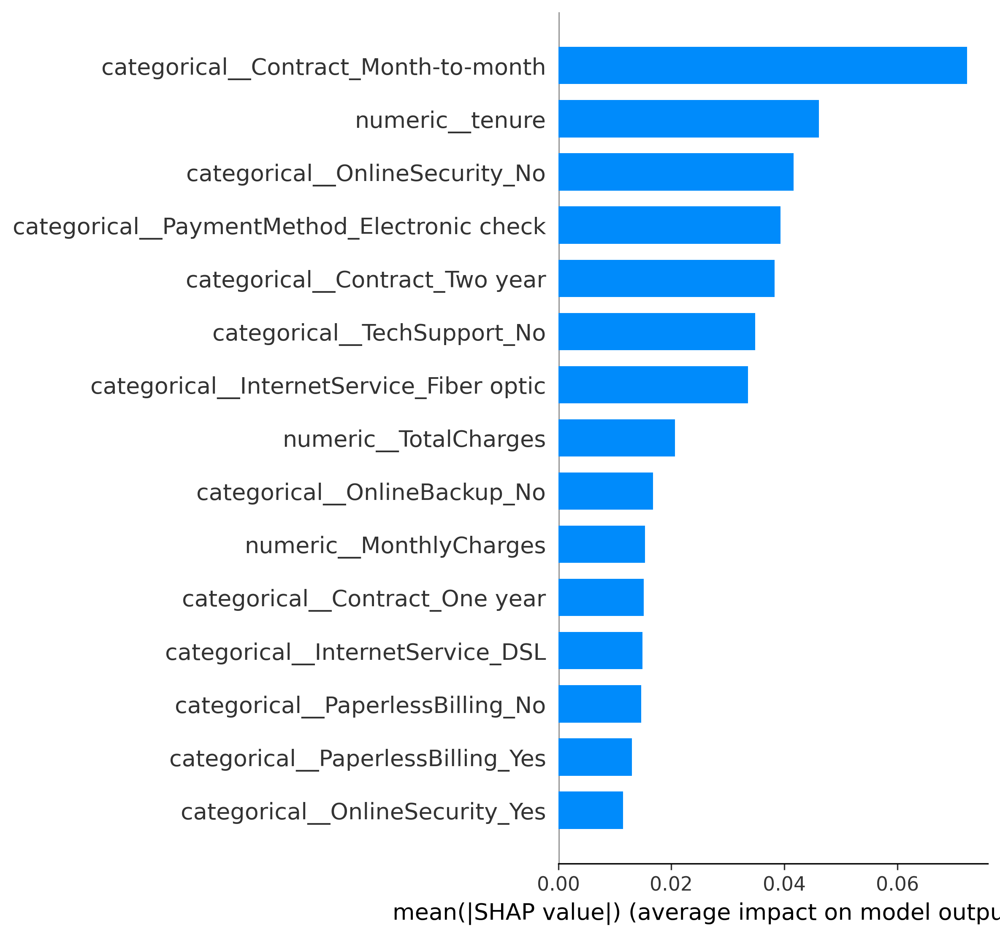
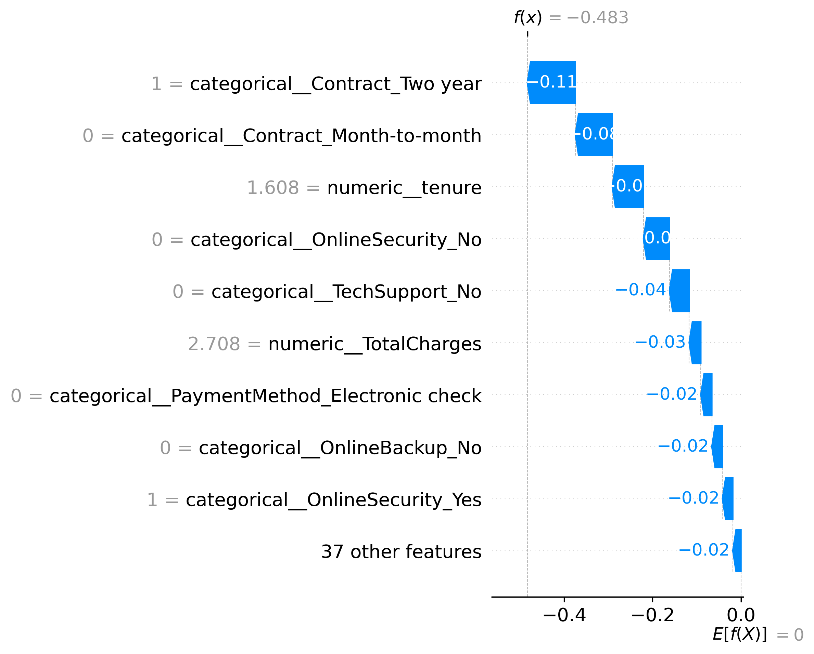
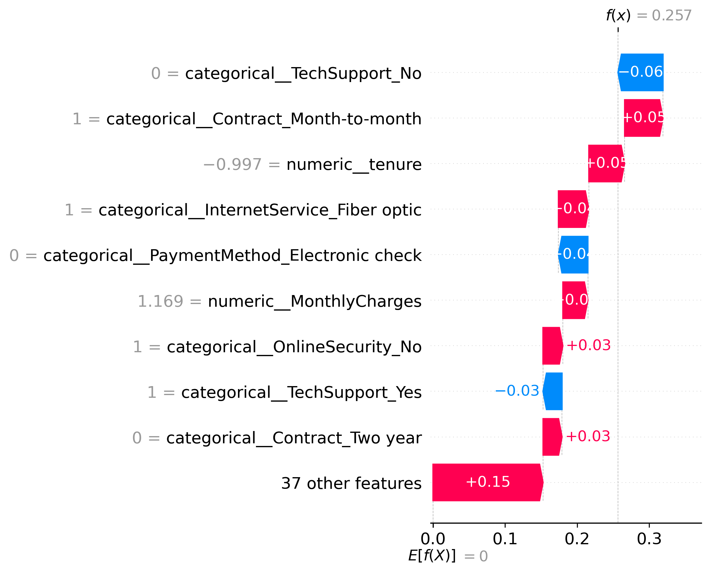
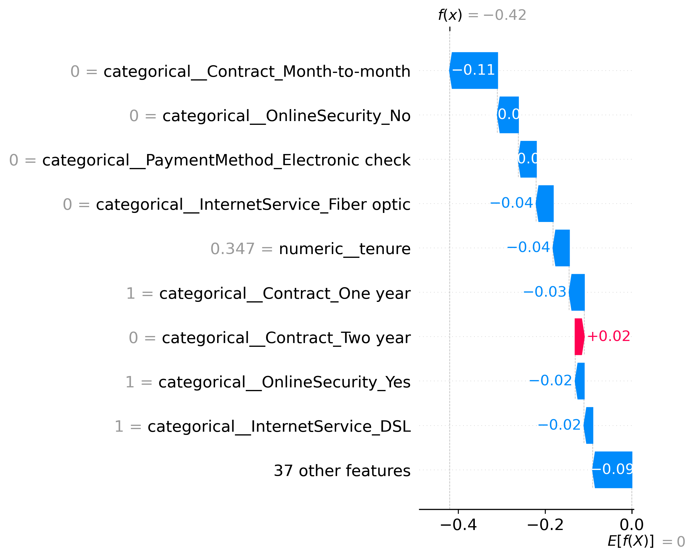

# Confusion Matrix

(How well did the model classify? - evaluation graph for any classification model.)

Because accuracy alone hides mistakes.

## My reading technique
Diagonal = Correct
Off diagonal = Errors

## Inference
The model prefers to catch churn customers even if it sometimes raises false alarms.
This is usually acceptable in churn prediction because missing a churn customer is more expensive.

## Insight
The model has:
- High recall
- Moderate precision

Ideal for customer retention.

---

# ROC Curve

(This measures the ranking ability of the model. Illustrates the performance of a binary classification model across all classification thresholds.)

"Yes or No" decisions. It helps us find the perfect balance between catching the things we want to catch and making accidental mistakes.

## My reading technique
- **Y-Axis (True Positive Rate):** Also known as Sensitivity or Recall. "How many of the actual 'Yes' cases did the model catch?" Higher is better.
- **X-Axis (False Positive Rate):** "How many false alarms did the model trigger?" Lower is better.

## Inference
The curve stays well above the diagonal — the model separates churn and non-churn well.

## Insight
The model has good discrimination ability.

---

# Threshold Tuning

(Optimises the decision threshold for both F1 score and business cost.)

---

# SHAP

(Why the model predicted what it predicted — it tells us which features are responsible for churn.)

SHAP is used on tree-like models. These models are like black boxes; SHAP opens them.

## My reading technique
Longer bar → Higher contribution.

### Summary Plot (beeswarm)

### Feature Importance (bar)

### Waterfall — Individual Predictions

**Sample 0**

**Sample 1**

**Sample 2**

## Inference
1. **Month-to-month Contract** — Largest impact. Customers on month-to-month contracts influence predictions the most.
2. **Tenure** — Longer tenure → Lower churn.
3. **Security** — People without online security are more likely to churn.

## Insight
Top drivers:
- Month-to-month contract
- Tenure
- Online Security
- Payment Method
- Tech Support
- Fiber Internet

**Business recommendation**

Offer:
- Yearly contracts
- Bundled security
- Tech support

to reduce churn.